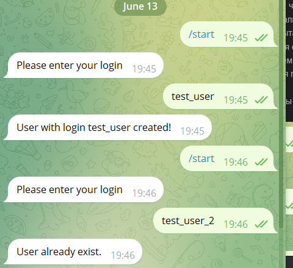
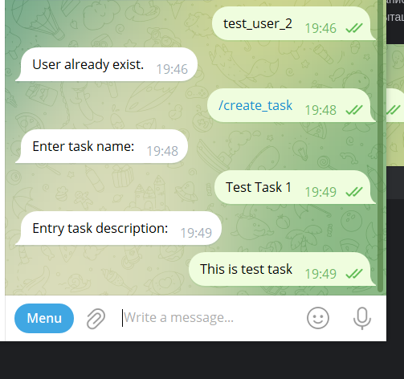
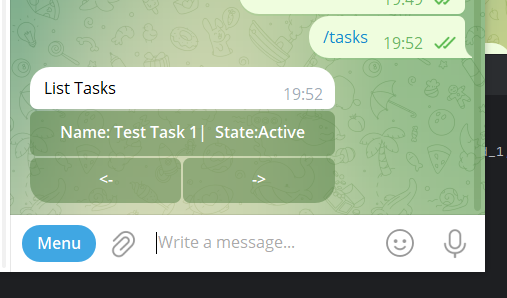
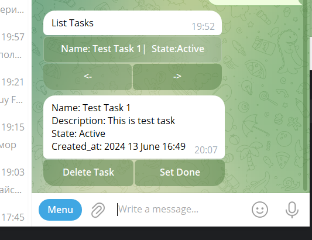

Поднятие приложения:
1. Заполнить в файле .enc.example BOT_TOKEN, API_HASH, API_ID , их можно получить создан приложение в тг и создав бота через bot_father
2. Переименовать файл .env.example в .env. И запусть следующие команды docker-compose build затем docker-compose up

Описание работы приложения
1. Команда /star. При выборе этой команды, выведетсья сообщение, чтобы пользователь ввел свой логин. 
После ввода логина, создасться запись в таблице users. Кроме логина пользователя
из данных пользователя в тг вытащим Имя, Фамилию и Никнейм в тг.

Если пользователь попытается еще раз выполнить комманду /start  вести и зарегестрироваться, 
то выведем сообщение что пользователь уже зарегестрирован. Уникальность обеспечивается по уникальному
id в тг чате пользователя и логину
3. Задачу создаем через кнопку /create_task. При вводе этой команды будет предлагаться
вести имя задачи и описание задачи. Две кнопки снизу <- и -> позволяют пагинироваться по страницам с задачами.
На одной страницы может быть максимум 10 задач

4. Чтобы вывести список задач нужно нажать выбрать команду /tasks. И выведеться весь список задач
для текущего полбзователя

В задаче отображется Имя задачи и статус задачи. При нажатии на задачу отображется описание задачи
и кнопки для взаимодействия с задачей

При нажатии на кнопку Delete Task удаляет задачу, кнопка Set Done меня у задачи статус c Active на Done

Технологии:
в качестве библиотеки для бота выбрал pyrogram
pyromod  использую для ожидания ответа клиента
В качестве orm использую sqlalchemy в качестве менеджера миграций использую alembic

Описание функциональности:
1. База данных состоит всего из двух таблиц Users и Tasks. Связь между таблица Many2One
У одного пользователя может быть множество тасок. В таблице Tasks ключем связи выступает
поле user_id
2. Описание компонет системы

В файле command.py находятся все команды для взаимодействия с пользователем
При вызове команды /start будет start_command в нем вызовется метод 
Userservice (в этом классе собраны все методы для взаимодейтсвия с пользователм)
create_user - в этом методе делается запрос в базу на проверку пользователей, если пользователя
нет то делается insert записи в базу данных

При вызове команды /create_task после заполнения данных вызовется метод
из TaskService(класс для работы с таблицей Tasks) create_task - в этом методе
выполниться запрос на проверку существования пользователя если пользователь есть то
выполниться insert на создание задачи

При вызове метода tasks выполниться под копотом обрабочика задач выполниться метод
get_list_of_tasks. В этом методе выполниться orm запрос 

messages_data = await session.execute(select(Users, Tasks).join(
                Users, Users.id == Tasks.user_id).where(
                Users.id == user_id,
            ).order_by(Tasks.created_at).limit(10))

Его можно интерпретировать на следующий sql

SELECT *
FROM Users
JOIN Tasks ON Users.id = Tasks.user_id
WHERE Users.id = <user_id>
ORDER BY Tasks.created_at
LIMIT 10;

Достаем по дате первый 10 записей для текущего пользователя. После получения 10 тасок
формируем inline_keyboard это делается в методе tasks_inline_keyboar.
При создании InlineKeyboardButton в callback_data ложим данные определнным образом
(метод)|(task_id) прямая черта | выступает ввиде разделителя пример get_task_info|{task_id}

Это нужно для того что при нажатии пользователем на кнопку могли обработать callback и сделать
соответсвующие действия в зависимости от нажатия. Это все обрабатывает класс
KeyboardController В нем основнйо метод callback_handler в нем сплиться дата по | на метод и id задачи,
и вызов метода идет через getattr в котором как параметр будет передавать id задачи

Все методы для работы с callback реализованым в это классе

Пагинация по задачам будет работать следующим образом. В callback_handler
есть два метода prev_page и next_page . Метод prev_page принимает id самой первой таски на страницк
next_page принимает id псоледней таски на странице. Пагинацию осуществляет метод cursor_list_of_task
принцип работы его то что он принимает id и параметр is_next и взависимости от этого параметра делает запрсо в бд
если prev_page то отсортирует таски по дате и заберет первых 10 тасок которые меньше этго значение, 
с next_page на оборот. При случае если это первая страница то prev_page проверит это и выведет ее же,
при next_page елси это последняя страница то сделает проверку и выведет ее же

